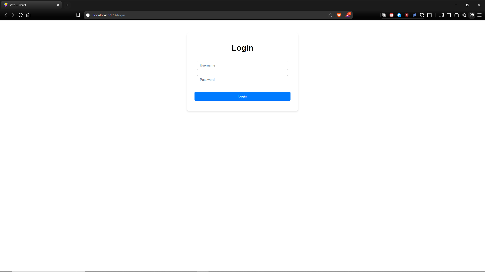
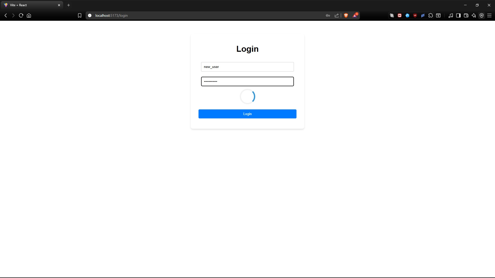
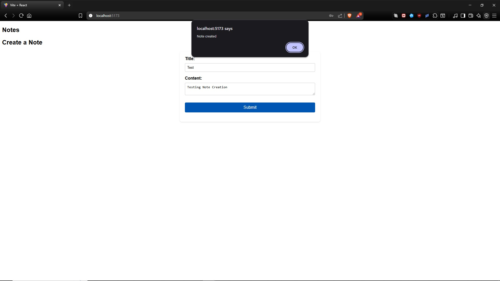
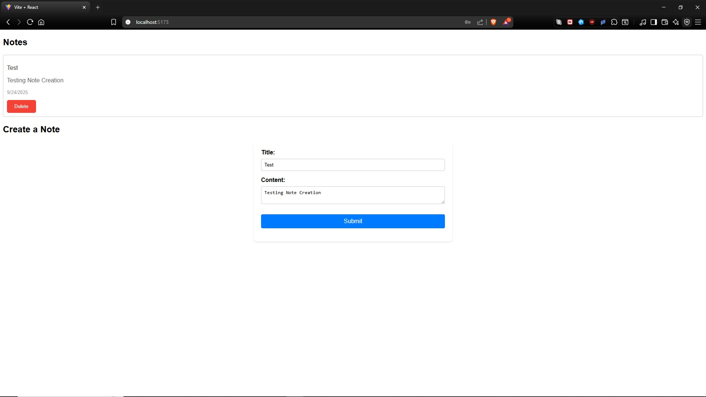

# 🔄 Task Manager

A minimalist web app designed to help users experiment with connecting a Django backend with a React frontend, while implementing JWT authentication and practicing Django REST Framework.

---

## 📸 Screenshot

---

## 🎯 Purpose & Features

This project was not deployed as it is a small-scale experiment. The focus of the project was to:

- Explore JWT-based authentication with Django REST Framework
- Connect a Django backend to a React frontend
- Implement CRUD functionality (create, read, delete notes)
- Gain practical experience with axios for API calls and state management in React

---

## 🛠️ Tech Stack

- **Django** - Backend framework
- **Django REST Framework (DRF)** - API and serialization
- **SQLite** - Lightweight local database
- **React** - Frontend library
- **Axios** - HTTP requests to Django API
- **JWT (SimpleJWT)** - Authentication and authorization
- **HTML5 & CSS3** - Frontend structure and styling

---

## 🚀 Getting Started

To run this app locally:

### 1. Clone the repository

git clone https://github.com/zandernh/focushive.git
cd focushive

### 2. Set up a virtual environment

python -m venv venv
source venv/bin/activate  # On Windows: venv\Scripts\activate

### 3. Install backend dependencies

pip install -r requirements.txt

### 4. Apply database migrations

python manage.py migrate

### 5. Create a superuser (optional, for admin access)

python manage.py createsuperuser

### 6. Run the Django development server

python manage.py runserver

### 7. Start the React frontend

cd frontend
npm install
npm run dev

### 8. Access the app

- **Backend** : http://127.0.0.1:8000
- **Frontend** : http://localhost:5173 (or default Vite port)

---

## 🧠 How It Works

- Users can register and log in to manage their notes
- Create, view, and delete notes via the React frontend
- JWT tokens handle secure authentication between frontend and backend
- Admin panel allows inspection and management of users and notes

---

## 📄 License

This project is open-source and free to use under the MIT Licence

---

## 🙋‍♂️ Author

Built by Zander Harding
